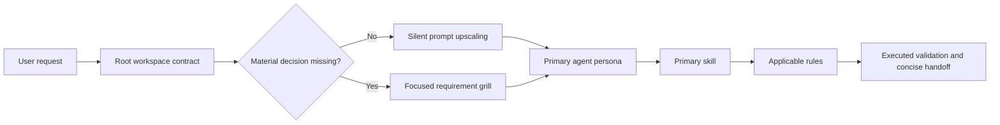

# Agents

A universal, portable software-engineering control plane for Cursor, Claude
Code, and Google Antigravity. One policy body, one set of agent personas, and
one skill library serve all three hosts, backed by deterministic local
validation — clone this repository once and reuse it across any project on
any of the three.

The design assumes prompts may be short. Safe ambiguity is silently expanded
into a professional execution contract; decision-changing ambiguity triggers a
focused requirement grill. Every implementation remains subject to memory,
resource, complexity, architecture, security, testing, and evidence checks.

## Installation

This repository is the canonical payload; nothing in it needs to be copied by
hand.

### Clone Once, Install Per Project

Clone this repository anywhere on the machine — once, ever:

```bash
git clone https://github.com/RahulBiju-dev/agents.git ~/.agents-src
```

Then, in any project that should get the toolkit, run the installer from the
project root:

```bash
cd your-project
~/.agents-src/install.sh
```

That is the whole setup. No submodule, no vendored copy, and nothing the
project has to track in its own git history.

`install.sh` forwards to `scripts/install.py`, which symlinks `agents/`,
`commands/`, `workflows/`, `rules/`, and `skills/` (skipping
underscore-prefixed templates) into `.cursor/`, `.claude/`, and `.agents/`,
and symlinks `AGENTS.md` and `CLAUDE.md` to the project root — whichever
hosts you actually use immediately see every persona, command, workflow,
rule, and skill.

| Flag | Effect |
|---|---|
| `--target /path/to/project` | install somewhere other than the current directory |
| `--hosts cursor,claude` | install for a subset of `cursor`, `claude`, `antigravity` |
| `--dry-run` | print every planned link without touching the filesystem |
| `--uninstall` | remove only the links this installer created |
| `--link-style relative\|absolute` | override the link form chosen automatically |

Links point back into the clone, so `git pull` in `~/.agents-src` updates
every project at once — no reinstall needed. Re-run the installer only to
pick up newly added personas, commands, or skills, which is always safe: a
link it previously created is refreshed, a link left dangling by a moved or
deleted clone is repaired, and a real file left in its place is reported and
never touched.

By default the installer writes absolute links when the clone lives outside
the project and relative links when it lives inside one, so the links keep
resolving either way. Because those links only resolve on the machine holding
the clone, a shared project usually wants `.cursor/`, `.claude/`, `.agents/`,
`AGENTS.md`, and `CLAUDE.md` in its `.gitignore` or `.git/info/exclude`. The
installer prints that reminder and never edits either file itself.

### Manual Placement

Without running the installer, the same mapping applies:

| Host | Project placement |
|---|---|
| Cursor | `agents/*.md` → `.cursor/agents/`; `commands/` → `.cursor/commands/`; `rules/` → `.cursor/rules/`; `skills/` → `.cursor/skills/` |
| Claude Code | `agents/*.md` → `.claude/agents/`; `commands/` → `.claude/commands/`; `skills/` → `.claude/skills/` |
| Antigravity | `agents/*.md` → `.agents/agents/`; `workflows/` → `.agents/workflows/`; `skills/` → `.agents/skills/` |

Exclude the underscore-prefixed templates when copying, so no host registers a
`/_TEMPLATE` route or offers a template package for selection.

Keep `AGENTS.md` at the project root. Cursor and Antigravity read it as
workspace context. Claude Code reads `CLAUDE.md`, which imports `AGENTS.md`, so
all three hosts share one policy body.

Rules are expressed as Cursor `.mdc` files because Cursor discovers that format
natively. Their essential safety, architecture, ambiguity, and evidence
requirements are also present in `AGENTS.md`, so Claude Code and Antigravity do
not lose the core guardrails.

For machine-wide reuse, install reviewed agent profiles in
`~/.cursor/agents/`, `~/.claude/agents/`, or `~/.gemini/config/agents/`.
Project-local placement is safer when a profile or skill contains
repository-specific behavior.

## Usage

Once the installer has run, every host reads the same personas, routes, and
skills. What changes per host is only the syntax you type.

### The Personas

| Persona | Use it for | Authority |
|---|---|---|
| `planner` | Designing a feature or optimization before any code is written; produces an implementation plan | Read-only; writes a plan, not code |
| `code-reviewer` | Code, architecture, and security review, plus debugging | Read-only, except documentation that contradicts a reviewed change |
| `documentation-creator` | Production documentation and information architecture | Writes docs; not artifact generation |
| `assignment-solver` | End-to-end university or graded coursework | Full task execution; invoke only when you say it is coursework |
| `example-engineer` | Nothing real — it is the format reference for authoring new profiles | None; replace it with a real persona |

`assignment-solver` never activates on its own. It runs only when you state
that the work is being assessed, so ordinary engineering tasks are never
silently treated as coursework.

### Invoking A Persona

Three ways to reach a persona, in increasing scope:

| | Cursor | Claude Code | Antigravity |
|---|---|---|---|
| Pick one for this task | `/planner` | `@agent-planner` | `/agents` to list or switch |
| Let the host choose | Delegates by profile description | Delegates by profile description | The planner may delegate by description |
| Bind a whole session | — | `claude --agent planner` | — |

Automatic delegation reads the `description` in each profile's frontmatter, so
a request that clearly matches a persona reaches it without being named. Name
the persona explicitly when you want to override that choice.

### Slash Routes

Commands and workflows are the same routes under the same basenames:
`commands/` serves Cursor and Claude Code, `workflows/` serves Antigravity.
Type `/<name>` in any of the three and the route resolves to the same skill
contract, so a route means the same thing wherever you run it.

### Skills

Skills are not invoked by name. Each `SKILL.md` carries a routing description,
and the active model loads one only after the task selects it — the
always-loaded context stays small no matter how large the library grows. Add
skills freely; the cost of an unused skill is one description line.

### Attaching A Profile Instead Of Delegating

`@agents/planner.md` attaches that file as context. It does **not** spawn an
isolated subagent — native agent selection and a file attachment are distinct
operations on every host.

Attaching is the portable fallback when a host has no native trigger, or when
you want the current session to adopt a profile rather than hand work to a
separate one:

```text
Use @agents/planner.md for this API change
```

The registry in `AGENTS.md` tells the active model to adopt the attached
profile for that task only.

### Combining Profiles

Pick one primary persona by dominant risk, and at most two supporting profiles
when a task genuinely crosses responsibility boundaries. A profile may narrow
what the model is allowed to do; it can never widen it past platform policy or
the scope you gave.

### Updating

The installed entries are symlinks into your clone, so updating every project
at once is one command:

```bash
git -C ~/.agents-src pull
```

Existing personas, routes, and skills update immediately. Re-run
`~/.agents-src/install.sh` in a project only when the pull added new files that
need fresh links.

### Removing

```bash
cd your-project
~/.agents-src/install.sh --uninstall
```

This removes the links the installer created, plus any left dangling by a
clone that has since moved. Any real file you put in a linked path is left
untouched, and the now-empty `.cursor/`, `.claude/`, and `.agents/`
directories remain for you to delete if you want them gone.

Moving the clone does not strand a project: run `--uninstall` or a plain
re-run from the clone's new location and the stale links resolve again.

### Troubleshooting

| Symptom | Cause and fix |
|---|---|
| A host shows no personas or routes | The installer was never run in that project, or it ran with `--hosts` excluding that host. Re-run it from the project root. |
| `skip (exists, not managed by this script)` | A real file already occupies that path. The installer never overwrites it. Move or delete the file, then re-run. |
| Links resolve to nothing | The clone was moved or deleted. Re-run the installer from the clone's new location; it repairs every dangling link it finds. |
| `replacing broken link` | Expected after moving the clone — the stale link is being repointed. A dangling link of your own at a linked path is reclaimed too. |
| A new persona or skill is missing | Links exist per entry, so a newly added file needs a fresh link. Re-run the installer after pulling. |
| Unsure what a run will change | `~/.agents-src/install.sh --dry-run` prints every planned link and touches nothing. |

Run `~/.agents-src/scripts/validate_workspace.py` from inside the clone to
confirm the registries themselves are intact.

## Architecture

```text
.                              (this repository, cloned anywhere on the machine)
├── .gitignore                local Python and test artifact exclusions
├── install.sh                per-project entry point; forwards to scripts/install.py
├── AGENTS.md                 canonical workspace policy and routing registry
├── CLAUDE.md                 Claude Code import bridge
├── agents/                   flat portable persona definitions
│   ├── _TEMPLATE.md          authoring template
│   ├── assignment-solver.md  end-to-end coursework/assignment workflow
│   ├── code-reviewer.md      code, architecture, and security review
│   ├── example-engineer.md   worked example
│   └── planner.md            implementation planning and design
├── commands/                 Cursor and Claude Code slash commands
│   ├── _TEMPLATE.md
│   └── example.md
├── workflows/                Antigravity slash trajectories
│   ├── _TEMPLATE.md
│   └── example.md
├── rules/                    Cursor rule files
│   ├── _TEMPLATE.mdc
│   └── 01-example-guard.mdc
├── skills/                   on-demand skill packages
│   ├── _template/            authoring template package
│   └── example-skill/
│       ├── SKILL.md          routing description and operating contract
│       ├── agents/
│       │   └── openai.yaml   concise discovery metadata
│       ├── references/       deep guidance only where the skill requires it
│       └── example_utility.py  present only for executable utility skills
└── scripts/
    ├── install.py             symlink installer for host-native config dirs
    └── validate_workspace.py  deterministic registry and structure validator
```

Each skill is self-contained and loaded only after routing selects it. The
always-loaded context therefore stays compact even as the toolkit grows to cover
a wide engineering surface.

Files and directories whose name begins with an underscore are authoring
templates. They are copy sources, never routed to, and skipped by the validator.



## How Each Platform Interacts

What each host discovers, and in what order. For what to type, see
[Usage](#usage) above.

### Cursor

1. Root `AGENTS.md` establishes the workspace contract and portable aliases.
2. `.cursor/rules/*.mdc` attaches the short global rules and only the language or
   domain rules whose globs or descriptions match the active work.
3. `.cursor/commands/*.md` exposes the slash routes.
4. `.cursor/agents/*.md` enables native specialist delegation from profile
   descriptions; `/example-engineer` explicitly selects that persona.
5. `.cursor/skills/*/SKILL.md` supplies the selected task method without loading
   the entire library.

### Claude Code

1. Root `CLAUDE.md` imports `AGENTS.md`.
2. `.claude/commands/*.md` exposes the same slash routes as Cursor.
3. `.claude/agents/*.md` enables automatic delegation by description,
   `@agent-example-engineer` for a specific task, and
   `claude --agent example-engineer` for a session.
4. `.claude/skills/*/SKILL.md` provides the routed workflow and any bounded
   utility or reference it names.

### Google Antigravity

1. Root `AGENTS.md` supplies workspace policy and alias resolution.
2. `.agents/agents/*.md` exposes native custom agents; `/agents` lists or
   switches them and the planner may delegate by profile description.
3. `.agents/workflows/*.md` binds each slash name to its deterministic
   trajectory.
4. `.agents/skills/*/SKILL.md` supplies the selected operating contract.

Antigravity consumes `workflows/`, while Cursor and Claude Code consume
`commands/`. Every basename is paired, so a route has the same intent across
hosts.

Platform behavior and placement were checked against official documentation on
2026-08-06:

- [Antigravity custom agents](https://antigravity.google/docs/subagents) and
  [workspace context](https://antigravity.google/docs/cli/best-practices).
  Antigravity migrated its default directory from singular `.agent/` to
  plural `.agents/`; this repo already targets the current plural form.
- [Cursor subagents](https://cursor.com/docs/subagents),
  [rules](https://cursor.com/docs/rules),
  [`@` context](https://cursor.com/docs/agent/prompting), and
  [skills](https://cursor.com/docs/skills)
- [Claude Code subagents](https://code.claude.com/docs/en/sub-agents) and
  [workspace memory](https://code.claude.com/docs/en/memory)

## Authoring

`scripts/validate_workspace.py` enforces the contract below. Copy the matching
template, fill it in, then run the validator.

| Artifact | Required frontmatter | Additional requirements |
|---|---|---|
| `agents/<name>.md` | `name`, `description`, `model` | `name` equals the filename stem; `model: inherit`; headings `Role`, `Scope`, `Guardrails`, `Workflow`, `Output Contract` |
| `skills/<name>/SKILL.md` | `name`, `description` | `name` equals the directory name; description is at least 25 characters and states activation with `Use when`, `Use for`, `Use before`, `Use after`, `Use to`, or `Use implicitly` |
| `skills/<name>/agents/openai.yaml` | none | `interface:` mapping with quoted `display_name`, `short_description` of 25 to 64 characters, and `default_prompt` containing `$<name>` |
| `commands/<name>.md` | `description`, `argument-hint` | body references `skills/<skill>/SKILL.md` |
| `workflows/<name>.md` | `name`, `description` | `name` equals the filename stem; body references `../skills/<skill>/SKILL.md` |
| `rules/NN-<name>.mdc` | `description`, `globs`, `alwaysApply` | two-digit prefixes contiguous from `01`; at least one rule sets `alwaysApply: true` |

The frontmatter key set must match exactly. Extra or missing keys are errors.

Every slash route exists twice, once in `commands/` and once in `workflows/`,
under the same basename. Both files must resolve to the same skill contract so a
route means the same thing on every host.

Text files may not contain unfinished-work markers or a literal ellipsis, and
every relative Markdown link must resolve. The exact rejected markers are listed
in `PLACEHOLDER_PATTERNS` in the validator. Skill utilities are standard library
only, take an explicit argument vector, bound their output, and must be
executable.

### Adding A Skill

1. Copy `skills/_template/` to `skills/<name>/` and set `name` in `SKILL.md` to
   the new directory name.
2. Fill in `agents/openai.yaml`, including `$<name>` in `default_prompt`.
3. Keep `references/` only for guidance too long or too optional for the
   contract; delete it otherwise.
4. Add a utility only when deterministic local computation genuinely beats
   prose, then `chmod +x` it.
5. Copy `commands/_TEMPLATE.md` and `workflows/_TEMPLATE.md` to the same
   basename and point both at the new skill.
6. Declare the skill under `### Declared Skills` in `AGENTS.md` using the exact
   `` - `name` — purpose. `` form the validator parses.
7. Run `./scripts/validate_workspace.py`.

### Adding An Agent Persona

1. Copy `agents/_TEMPLATE.md` to `agents/<name>.md`.
2. Set `name` to the filename stem and `model` to `inherit`.
3. Fill in the required `Role`, `Scope`, `Guardrails`, `Workflow`, and
   `Output Contract` headings.
4. Declare the persona under `### Declared Profiles` in `AGENTS.md` using the
   exact `` - `@name` → `agents/name.md` — purpose. `` form the validator
   parses; the alias must equal the filename stem.
5. Run `./scripts/validate_workspace.py`.

### Adding A Command + Workflow Route

1. Copy `commands/_TEMPLATE.md` and `workflows/_TEMPLATE.md` to the same
   `<name>` basename in their respective directories.
2. Point both bodies at the same `skills/<skill>/SKILL.md` target — the
   validator requires the pair to resolve to an identical skill contract so
   the route means the same thing on every host.
3. No `AGENTS.md` declaration is needed; routes are only cross-checked
   file-to-file between `commands/` and `workflows/`.
4. Run `./scripts/validate_workspace.py`.

### Adding A Rule

1. Copy `rules/_TEMPLATE.mdc` to `rules/NN-<name>.mdc`, using the next
   contiguous two-digit prefix.
2. Set `description`, `globs`, and `alwaysApply` in the frontmatter.
3. Confirm at least one rule in the directory has `alwaysApply: true` — the
   validator rejects a rule set with none.
4. No `AGENTS.md` declaration is needed; rules are validated within
   `rules/` only.
5. Run `./scripts/validate_workspace.py`.

## Validation

Run the complete deterministic structural audit:

```bash
./scripts/validate_workspace.py
```

It verifies agent and skill frontmatter, unique names, root registry
declarations against the files on disk, skill UI metadata, command and workflow
parity with matching skill targets, rule ordering, local Markdown links,
forbidden unfinished markers, Python syntax, and executable bits.

Runtime requirements are Python 3.10 or newer and Git. Local code execution uses
the user's ordinary operating-system access; time and output limits reduce risk
but are not a security sandbox.
